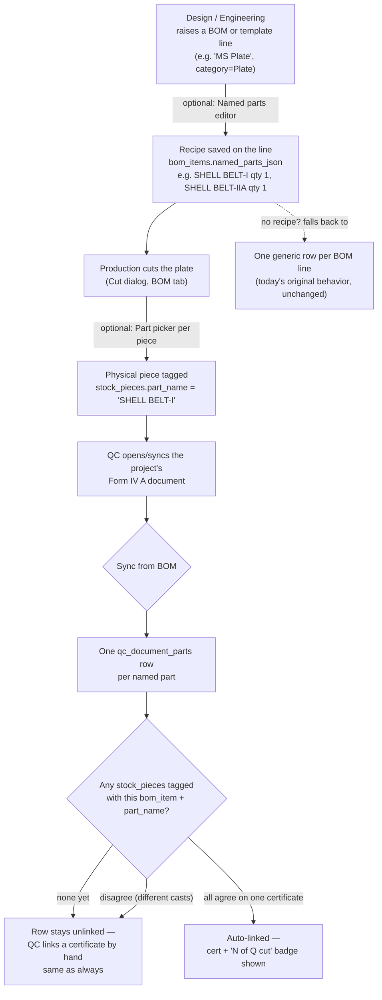

# Named Boiler Parts — how it works (shipped 2026-08-25)

Plain-language guide to the "named parts" feature: one purchased BOM line (e.g. a single MS Plate)
can become several separately-named fabricated parts (e.g. `SHELL BELT-I`, `SHELL BELT-IIA`), which
is what QC's Form IV A statutory document actually needs to list. See `SYSTEM.md`'s Statutory
Documents section for the short version and the original problem this solves.

## The three-step flow

Three departments, three responsibilities — nobody has to do all of it, and skipping a step never
breaks anything:

1. **Design / Engineering — the plan.** Optional. If nobody fills it in, the line behaves exactly
   as it always did (one generic row on the QC document).
2. **Production — the physical reality.** Optional. If nobody tags a cut piece, QC just links a
   certificate by hand, same as before this feature existed.
3. **QC — reconciliation.** Automatic, runs every time "Sync from BOM" is clicked. Only auto-fills
   a certificate when it's *certain* (every physical piece cut for that named part agrees on one
   cast) — it never guesses, and it never overwrites a certificate a human already picked.

## How-to: Design / Engineering (Raise PR or a BOM/PR template)

1. On a line, pick a **Category** (Plate, Round Bar, etc.) as usual.
2. A new **"Named parts (optional — for QC statutory forms)"** button appears under the dimension
   fields. Click it to expand.
3. Add a row per named part: **Name** (e.g. `SHELL BELT-I`) + **Qty**. Add as many as the drawing
   calls for.
4. That's it — nothing else changes. Weight, size/spec auto-fill, MOC, all work exactly as before.

**Best place to do this: on a template item**, not a one-off BOM line. A template's named-parts
recipe carries into *every* project built from that boiler model, so it's defined once per boiler
model rather than re-typed on every project.

**Skip it entirely for:** bought-out fittings, single-piece lines, anything where one BOM line
already *is* one physical part. There's no cost to leaving it blank.

## How-to: Production (Cut dialog, Production → BOM tab)

1. Open **Cut** on a BOM line as usual — pick the source piece, enter Used/Remnant dimensions.
2. If that BOM line has a named-parts recipe, each **Used** row gets an extra **"Part (optional)"**
   dropdown, listing the named parts from the recipe.
3. Pick which named part this physical piece fulfills (or leave it blank — still allowed).
4. Click **Cut** as normal.

If a BOM line has no recipe, the dropdown simply doesn't appear — nothing to fill in, nothing
changes about how Cut works today.

**Re-cutting/splitting a named part across multiple pieces is fine** — tag each one the same name.
QC's "N of Q cut" badge shows how many of the named part's required qty have actually been cut so
far, and reconciliation only auto-links a certificate once whatever's been cut *agrees* on one cast
(see below).

## How-to: QC (Form IV A / Statutory Documents)

Nothing new to learn — the existing **"Sync from BOM"** button does all of it:

- Named parts appear as their own numbered rows (instead of one generic row for the whole BOM line).
- A row reconciled to a physical cut piece shows a small **"N of Q cut"** badge and, once linked,
  the certificate badge auto-fills — exactly the same certificate display every other part already
  uses.
- A row still showing **"No certificate — Link…"** just means nothing's been reconciled yet (either
  nothing's cut, or what's cut so far doesn't agree on one cast) — link it by hand exactly as before.
  **A manual link always wins** — reconciliation will never overwrite it, even on a later re-sync.
- Re-run "Sync from BOM" any time after Production cuts more material — reconciliation re-checks
  every still-unlinked named part on that visit, not just brand-new rows.

## Where the data actually lives

| What | Column | Notes |
|---|---|---|
| The recipe (Design's plan) | `bom_items.named_parts_json` / `bom_template_items.named_parts_json` | `[{name, qty}, ...]`. Absent = no breakdown. |
| The physical tag (Production) | `stock_pieces.part_name` | Set only on "used" (finished) pieces, never on remnants/scrap. |
| The reconciliation link (QC) | `qc_document_parts.stock_piece_id` + `.test_certificate_id` | `stock_piece_id` is just a *representative* piece to show a code for — the actual link/no-link decision always looks at every matching `stock_pieces` row, not just one. |

No new tables. Every column above is a nullable addition to a table that already existed and
already did the adjacent job.

## FAQ

**Q: I added named parts to a line, but the QC document already had a generic row for it — now I
see both?**
A: Yes — sync never deletes existing rows. Delete the stale generic row by hand on the QC document
if you add a breakdown to a line that was already synced without one.

**Q: Why didn't the certificate auto-fill even though "1/1 cut" shows?**
A: The physical piece that was cut has no certificate linked to it yet (Stores links certs at
receipt time). Once it does, re-running "Sync from BOM" will pick it up.

**Q: Two pieces were cut for the same named part with different certificates — which one wins?**
A: Neither, automatically — the row stays unlinked on purpose. That's a real material discrepancy
(re-cut from a different cast) and needs a human to look at it and pick the right certificate by
hand.

**Q: Does this affect Stores?**
A: Stores doesn't cut (Production does) and doesn't tag named parts — but the Pieces lineage dialog
now shows a tagged piece's part name in its "For" column, so Stores can see it too.
